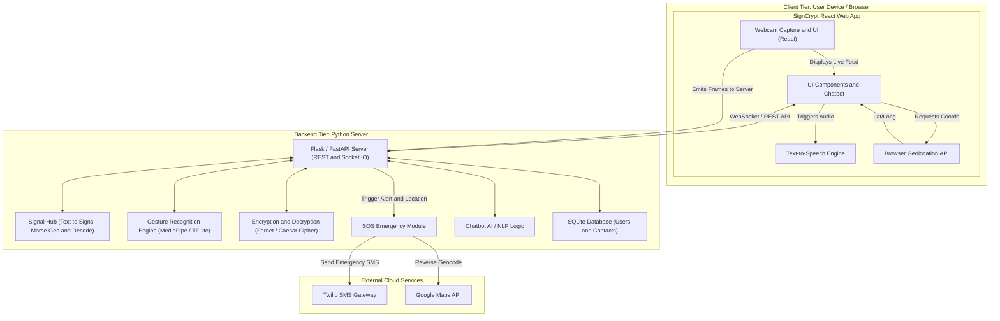

# 🤟 SignCrypt: Master Repository

**AI-powered sign language and secure communication platform using TensorFlow, OpenCV, React, and Morse Code integration.**

Welcome to the umbrella repository for **SignCrypt**. This platform bridges the communication gap between hearing- and speech-impaired individuals and the general public by integrating real-time gesture recognition, Morse code interpretation, and encrypted messaging into a unified, intelligent framework.

---

## 📂 Associated Repositories

This master repository connects our modular architecture. The system is split into two primary codebases to ensure high performance and seamless web accessibility:

* **🌐 Frontend (React Web App):** [Bobby-111/Frontend](https://github.com/Bobby-111/Frontend)
* **⚙️ Backend (Python + ML):** [Bobby-111/Backend](https://github.com/Bobby-111/Backend)

---

## 🚀 Key Features

* **Real-time ASL Gesture Recognition:** Utilizes TensorFlow Lite and MediaPipe to instantly translate hand signs into letters or words with high precision.
* **Morse Code Conversion & Encryption:** Converts physical gestures into Morse code and secures messages using the Caesar Cipher algorithm and Fernet encryption for private communication.
* **Centralized Signal Hub:** Acts as the communication backbone, synchronizing all modules (Sign, Morse, Text, and SOS) for low-latency, real-time data exchange.
* **SOS Emergency System:** Automatically fetches live GPS coordinates and sends SMS alerts to pre-saved emergency contacts during critical situations.
* **Text-to-Speech (TTS):** Converts recognized text into audible speech to facilitate smooth, two-way interactions.

---

## 🏗️ System Architecture

SignCrypt operates through a highly optimized client-server deployment model:

* **Frontend Layer:** Built with **React.js (v18+)** for a highly responsive, accessible web interface. It handles the user interactions, captures real-time hand gestures via webcam, and manages text-to-speech outputs.
* **Backend & Machine Learning Layer:** Powered by **Python, Flask/FastAPI, OpenCV, and TensorFlow**. It processes the heavy lifting for gesture prediction, encryption/decryption modules, NLP chatbot logic, and database management.

### 🛠️ Tech Stack
* **Frontend:** React.js, JavaScript (ES6+), HTML5, CSS3
* **Backend:** Python (Flask/FastAPI), SQLite, Socket.IO
* **AI/ML:** TensorFlow, TensorFlow Lite (TFLite), OpenCV, MediaPipe
* **Integrations:** Twilio (for SOS SMS), Web Speech API, Geolocation API

---

## 🏗️ System Architecture Diagram

SignCrypt utilizes a decentralized client-server deployment model. The React frontend runs in the user's browser to handle real-time UI interactions, text-to-speech, and local gesture capture. The Python backend (Flask/FastAPI) acts as the main router, delegating tasks to specific processing modules including the Signal Hub (for Morse/Sign conversions), the Gesture Recognition engine, and the SOS module.

## 📸 Screenshots

* **Home Dashboard:** Clean UI showing access to Sign Language, Morse Code, and Emergency SOS modules.
* **Signal Hub:** Interface for Morse generation, text-to-gesture conversion, and asset management.
* **Gesture Recognition:** Live webcam feed displaying bounding boxes, detected text, and stability/confidence scores.
* **Encryption/Decryption:** Secure messaging interface displaying generated cryptographic tokens and decrypted text.

---

## 👨‍💻 Author

**Bharath Chilaka** *AI/ML Researcher & Software Engineer* *Rajiv Gandhi University of Knowledge Technologies (RGUKT) - Ongole Campus*

---

## 🌐 Live Demo

Experience the real-time web deployment here: **[https://signcrypt.netlify.app/](https://signcrypt.netlify.app/)**
